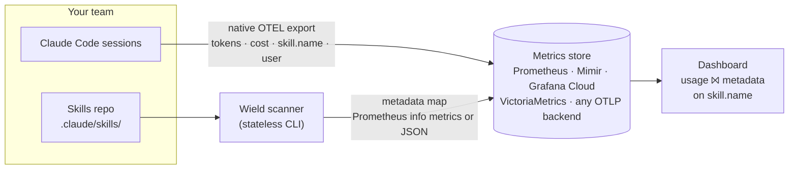

# Wield

**Usage analytics for Claude Code skills, built on OpenTelemetry.**

Wield shows which skills your team actually uses, who uses them, where they fit in your development lifecycle, and what they cost — so "you should try X when planning" is backed by evidence, not anecdotes.

Skills are authored and invoked exactly as normal. Wield only observes and annotates: it never writes to, moves, or gates a skill.

## How it works

Two data streams meet in your metrics store, and a dashboard joins them at query time on `skill.name`:



1. **Usage** — Claude Code natively exports OpenTelemetry metrics. Wield adds no instrumentation; it just turns the export on team-wide ([`ops/otel/`](ops/otel/README.md)). Every skill shows up here, annotated or not.
2. **Metadata** — teams describe their skills with [dimensions](docs/FORMAT.md) (e.g. `category`, `author`, `tags`) in `SKILL.md` frontmatter. The **scanner** walks the repo and exports the resulting metadata map — as JSON, or as Prometheus info metrics ready for any Prometheus-compatible store.

Because the join happens at query time, metadata is never baked into telemetry: re-categorise a skill today and all of its past usage reorganises under the new category instantly.

## The metrics

**From Claude Code telemetry** (native, per skill and per person):

| Metric                                                             | Key attributes                       | Answers                       |
| ------------------------------------------------------------------ | ------------------------------------ | ----------------------------- |
| `claude_code.token.usage` (`claude_code_token_usage_tokens_total`) | `skill.name`, `user.email`, model    | How much is each skill used?  |
| `claude_code.cost.usage` (`claude_code_cost_usage_USD_total`)      | `skill.name`, `user.email`, model    | What does each skill cost?    |
| `claude_code.skill_activated` events                               | `invocation_trigger`, `skill.source` | How are skills being invoked? |

Prompt content, code, and tool inputs/outputs are **never** captured — a commitment recorded in [`docs/consent.md`](docs/consent.md), not just a default.

**From the Wield scanner** (info metrics carrying the metadata map):

| Metric       | Labels                                        | Role                                        |
| ------------ | --------------------------------------------- | ------------------------------------------- |
| `skill_meta` | `skill_name` + one label per scalar dimension | The join target for grouping (`group_left`) |
| `skill_tag`  | `skill_name`, `key`, `value`                  | Set-membership filtering (`tags` and co.)   |

A typical panel query — tokens per skill, grouped by category:

```promql
sum by (skill_name) (rate(claude_code_token_usage_tokens_total[1h]))
  * on(skill_name) group_left(category)
    topk by (skill_name) (1, last_over_time(skill_meta[25h]))
```

## Quick start

**1. Describe a skill.** Add a `metadata` field to its `SKILL.md` frontmatter — an official Agent Skills spec field that clients ignore and that never enters the model's prompt:

```yaml
---
name: ticket-planner
description: Break a plan into tickets…
metadata:
  category: plan
  author: sarah
  tags: [experimental]
---
```

Keys are your team's vocabulary — nothing is reserved or required. Skills without `metadata` still appear in usage totals; they just carry no dimensions to group by.

**2. Scan.** The scanner is a pure function — files in, map out; no storage, no network:

```console
$ npm run scan -- --root examples/repo               # the metadata map, as JSON
$ npm run scan -- --root examples/repo --format prom # Prometheus info metrics
```

**3. Deliver the map.** Two legs, wire-identical ([docs/delivery.md](docs/delivery.md)):

- **CI** — a [reusable GitHub Actions workflow](.github/workflows/push-skill-metadata.yml) scans on merge and pushes the info metrics via Prometheus remote write.
- **Local** — `npm run push -- --root ~` delivers personal skills (`~/.claude/skills`) that no CI ever checks out.

**4. Turn on telemetry.** Deploy the managed-settings payload in [`ops/otel/`](ops/otel/README.md) to enable Claude Code's OTEL export team-wide. The README covers the gotchas that bite in practice (delta-vs-cumulative temporality, basic-auth encoding).

**5. Dashboard.** Import [`ops/grafana/skill-usage.dashboard.json`](ops/grafana/README.md): top skills by tokens and cost, usage by category, per-person breakdowns, and trends over time.

## Bring your own provider

Nothing in Wield is Grafana-specific. The pieces compose with whatever observability stack you already run:

- **Telemetry** is standard OTLP — point Claude Code's export at any OTLP-capable backend (Grafana Cloud is the verified reference; Datadog, Honeycomb, a self-hosted collector, etc. all speak the same protocol).
- **The metadata map** ships as Prometheus info metrics for remote-write stores, and VictoriaMetrics-style import endpoints accept the same rendering.
- **The JSON export** is the durable contract ([docs/FORMAT.md](docs/FORMAT.md)) for everything else — any tool that can join two datasets on `skill.name` can build the same views, no Prometheus required.

## Repository layout

| Path                              | What lives there                                                          |
| --------------------------------- | ------------------------------------------------------------------------- |
| [`src/scanner/`](src/scanner)     | The scanner CLI — frontmatter in, metadata map out                        |
| [`src/push/`](src/push)           | `wield push` — local delivery of the map to a remote-write endpoint       |
| [`src/plugin/`](src/plugin)       | Claude Code plugin (commands + doctor) for one-command project onboarding |
| [`ops/otel/`](ops/otel)           | Team-wide telemetry rollout config and verification notes                 |
| [`ops/grafana/`](ops/grafana)     | The Phase 1 dashboard JSON and panel documentation                        |
| [`docs/`](docs)                   | Format spec, ingest contract, delivery guide, consent, ADRs               |
| [`examples/repo/`](examples/repo) | A minimal skills repo to scan                                             |

## Status

Format spec, scanner, delivery, and dashboard are shipped; the team-wide telemetry rollout is in progress (pending [consent](docs/consent.md)). The Phase 1 plan lives in [docs/PRD.md](docs/PRD.md); the project's domain language in [CONTEXT.md](CONTEXT.md).
